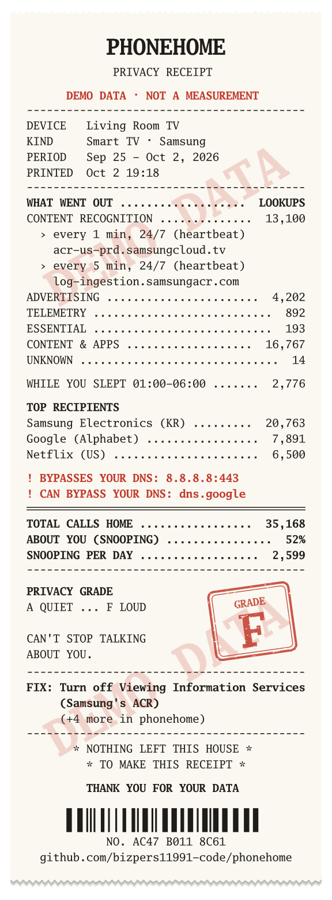
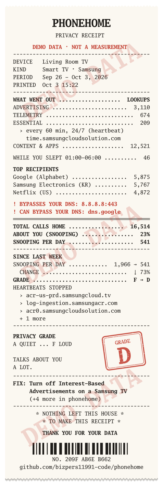
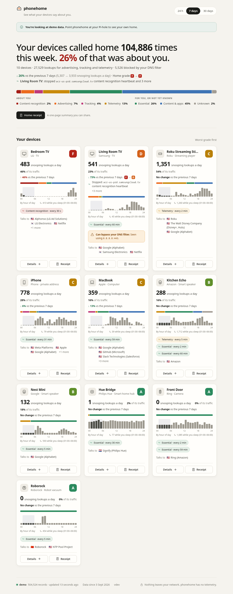
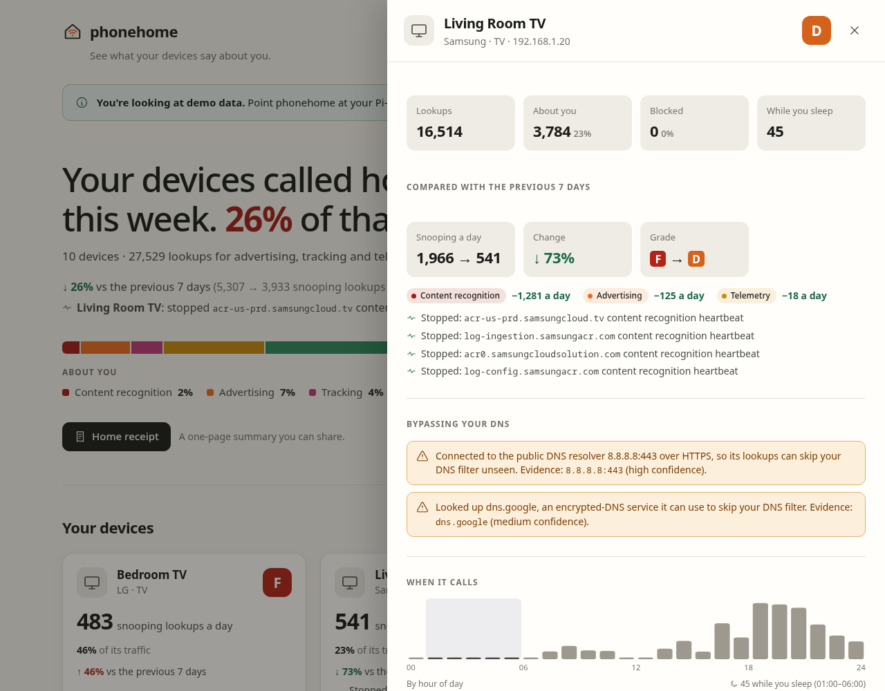
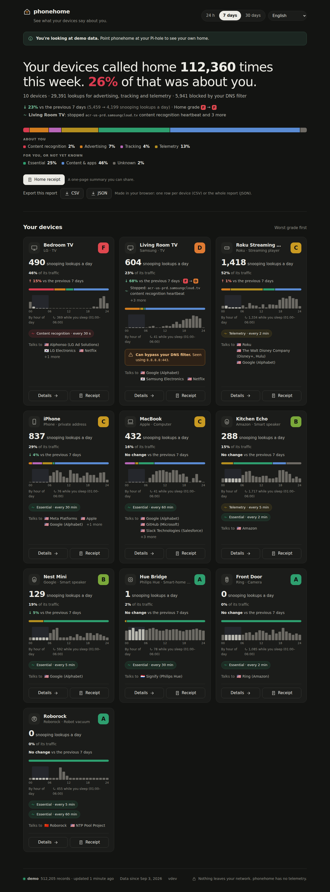
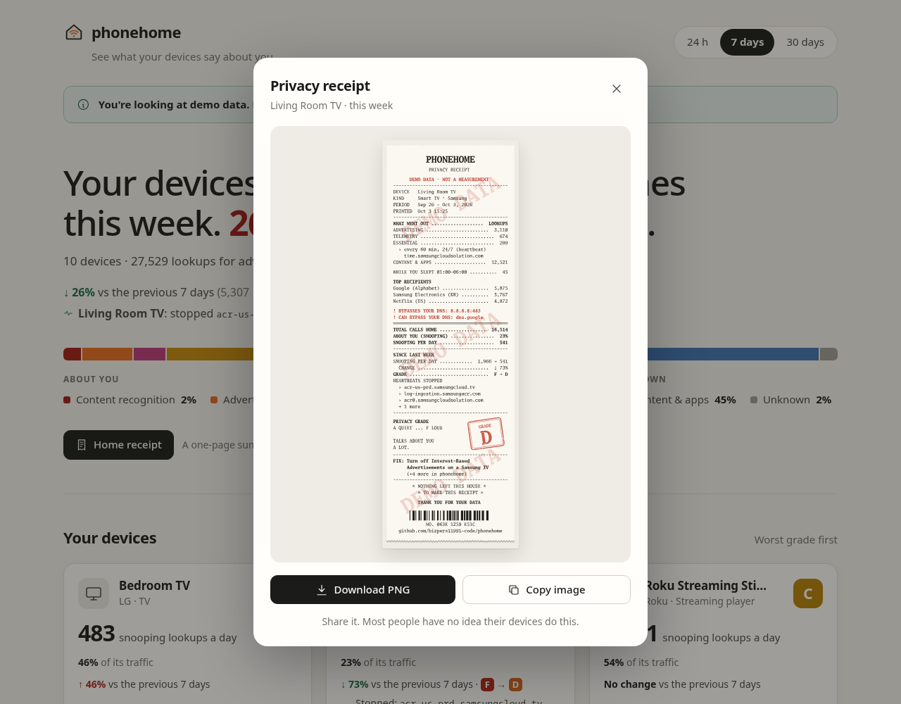
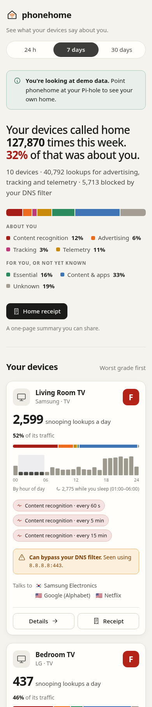
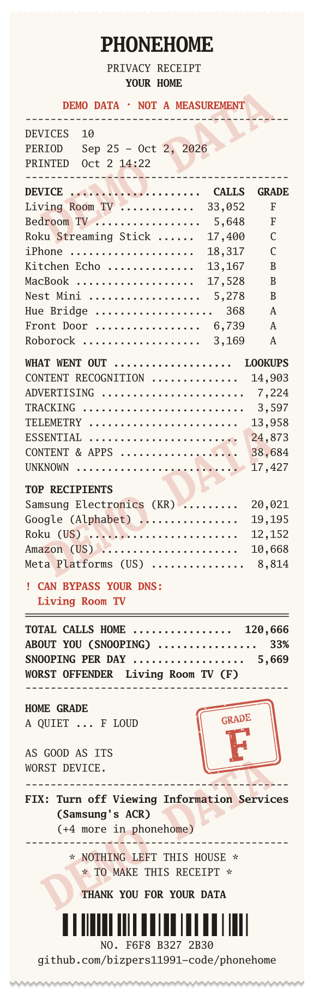

<div align="center">

# phonehome

**See what your devices say about you.**

phonehome reads the DNS logs your Pi-hole, AdGuard Home or router already keeps
and tells you, in plain English, what your smart TV, speakers, cameras and robot
vacuum send home: to whom, how often, and whether it happens while you sleep.
Then it hands you a receipt.

&nbsp;&nbsp;

<sub>The same TV before and after one setting was switched off. Receipts from the built-in demo household: the numbers are synthetic, which is why they are stamped DEMO DATA.<br>Yours will be real.</sub>

</div>

---

## Try it in ten seconds

No Pi-hole needed. This runs a synthetic household on your machine:

```sh
docker run --rm -p 8099:8099 ghcr.io/bizpers11991-code/phonehome demo --listen :8099
# or, with Go 1.27+
go run github.com/bizpers11991-code/phonehome/cmd/phonehome@latest demo
```

Open <http://localhost:8099>.



## What it finds

| | |
|---|---|
| **Content recognition (ACR)** | Smart TVs that fingerprint what is on screen, including HDMI inputs, and report it. phonehome knows the documented ACR endpoints of Samsung, LG (Alphonso), Vizio (Inscape), Samba TV and others. |
| **Heartbeats** | Devices that call a server on a clock, every 60 seconds, around the clock, whether anyone is using them or not. |
| **While you slept** | How much each device talked between 01:00 and 06:00 (you can set the window). |
| **DNS bypass** | Devices that can, or do, route around your Pi-hole with DNS-over-HTTPS, DNS-over-TLS or a hard-coded resolver. |
| **Who gets your data** | Every lookup is classified by a [knowledge base](kb/) of **784 rules across 146 companies**. Each rule cites its evidence and states a confidence level. |
| **What to do about it** | 41 researched, step-by-step fixes, such as *Settings › General & Privacy › Terms & Privacy › Viewing Information Services → Off*. Each fix is shown only for the devices it applies to. |
| **Since you fixed it** | Every report is compared with the period before it: grade F → D, ↓ 73% a day, which heartbeats stopped. Fix a setting, then come back next week for the second receipt. |

Every device gets a grade from A to F based on how much of its traffic is
about you rather than for you. [The rules are short and public.](docs/grading.md)

<details>
<summary><b>More screenshots</b></summary>

| Device details | Dark mode |
|---|---|
|  |  |

| Receipt | Phone |
|---|---|
|  |  |

| Whole-home receipt |
|---|
|  |

</details>

## Install

phonehome is a single static binary. It runs on anything from a Raspberry Pi
Zero to a NAS, and it only ever **reads** your DNS server's files.

**Step-by-step guides:** [Pi-hole in Docker](docs/setup/pihole-docker.md) ·
[Pi-hole on the host](docs/setup/pihole-bare-metal.md) ·
[Pi-hole on another machine](docs/setup/pihole-api.md) ·
[AdGuard Home](docs/setup/adguard-home.md) · [OpenWrt / dnsmasq](docs/setup/openwrt.md) ·
[Unraid](docs/setup/unraid.md) · [Synology](docs/setup/synology.md) ·
[Proxmox LXC](docs/setup/proxmox-lxc.md). Questions: [FAQ](docs/FAQ.md).
Prometheus, Grafana and Home Assistant: [docs/integrations.md](docs/integrations.md).

### Next to Pi-hole (Docker)

```sh
curl -O https://raw.githubusercontent.com/bizpers11991-code/phonehome/main/docker-compose.yml
docker compose up -d        # → http://<pi-hole-host>:8099
```

The compose file mounts `/etc/pihole` read-only, and phonehome finds the database on its own.
Pi-hole in Docker too? Use [`packaging/compose/pihole.yml`](packaging/compose/pihole.yml)
([guide](docs/setup/pihole-docker.md)); AdGuard Home: [`adguard.yml`](packaging/compose/adguard.yml).

### On the Pi-hole host (binary + systemd)

```sh
curl -fsSLO https://raw.githubusercontent.com/bizpers11991-code/phonehome/main/scripts/install.sh
less install.sh             # it's short, read it
sudo sh install.sh --systemd
```

The installer checks the release's SHA-256 before installing anything.
The service runs sandboxed, and Pi-hole's directory is read-only to it.

### Other setups

phonehome reads:

| Source | `type:` | Gives |
|---|---|---|
| Pi-hole v5/v6 database | `pihole-db` | DNS lookups + device names/MACs |
| Pi-hole v6 API (another host) | `pihole-api` | DNS lookups + device names/MACs |
| AdGuard Home query log | `adguard-querylog` | DNS lookups |
| dnsmasq `log-queries` (OpenWrt, plain dnsmasq) | `dnsmasq-log` | DNS lookups |
| DHCP leases (dnsmasq, ISC dhcpd, odhcpd) | `leases` | Device names/MACs |
| Linux conntrack | `conntrack` | Connections, used to catch DNS bypass |

With no config file, sources are auto-detected. To be explicit, copy
[`packaging/phonehome.example.yaml`](packaging/phonehome.example.yaml):

```yaml
sources:
  - type: pihole-db
    path: /etc/pihole/pihole-FTL.db
labels:
  "64:1c:ae:11:22:33": Living room TV
```

### From the command line

```sh
phonehome report                               # plain-text summary
phonehome receipt -o tv.png --device "Living room TV"
phonehome receipt -o home.png                  # the whole house
```

## What phonehome can and cannot see

This matters, so here it is plainly:

- **It sees who and when, never what.** Almost all of this traffic is
  encrypted. phonehome knows your TV looked up `acr-us-prd.samsungcloud.tv`
  1,440 times today. It cannot see what was sent.
- **DNS lookups are a lower bound.** Devices cache answers, so the real
  number of connections is usually higher.
- **A domain is evidence, not proof.** That's why every knowledge-base rule
  links to its source and carries a confidence level, and why a lot of traffic
  is honestly labelled *Essential* (firmware updates, time, the cloud your
  camera needs to work) so you don't break things by blocking it.
- **Bypass detection is partial in DNS-only mode.** Lookups of encrypted-DNS
  services are visible, but actual DoH connections need conntrack.

[docs/detectors.md](docs/detectors.md) explains every detector and its blind spots.

## Privacy

phonehome **talks to nothing but the sources you point it at**: no telemetry,
no update checks, no fonts or scripts from a CDN, no accounts. Everything it knows ships inside
the binary. The receipt footer says *"Nothing left this house to make this
receipt"*, and that has to stay true.

## Contribute what your devices do

The knowledge base is plain YAML in [`kb/`](kb/), and it is the part that gets
better with every home that runs phonehome. If you see an unknown domain, or a
device we don't cover yet:

1. Read the [knowledge-base guide](kb/README.md). It covers categories,
   confidence levels and what counts as evidence.
2. Add a rule, and run `go run ./cmd/phonehome kb lint`.
3. Open a pull request, or [report a device](../../issues/new?template=new-device.yml)
   if you'd rather not write YAML.

`phonehome unknown` lists the domains your devices use that the knowledge base
can't explain yet. In the dashboard, a device's details have a **Suggest a
rule** link that opens that issue form prefilled with those domain names and
the device's make and type, never its addresses or names.

Code contributions are welcome too. [docs/ARCHITECTURE.md](docs/ARCHITECTURE.md)
is the map. Tests: `go test -race ./...`.

## Built on the work of others

The knowledge base stands on published measurement research, especially
*Watching You Watch* (Moghaddam et al., CCS 2019), *The TV is Smart and Full of
Trackers* (Varmarken et al., PETS 2020), *Information Exposure From Consumer IoT
Devices* (Ren et al., IMC 2019), and *Watching TV with the Second-Party*
(Anselmi et al., IMC 2024). It also draws on vendor documentation and the
blocklist maintainers who have catalogued this traffic for years. And it
would not exist without [Pi-hole](https://pi-hole.net) and
[AdGuard Home](https://adguard.com/adguard-home/overview.html).

## License

[MIT](LICENSE)
